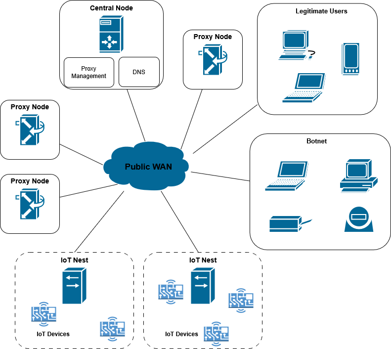

# DDOS-Dodger

A Moving Target Defense (MTD) system built to protect IoT web services from Distributed Denial of Service (DDoS) attacks by dynamically rotating IP addresses and proxy routes using a containerized SDN-like setup.

The used scripts should be ran in a VM, the Docker network will make an SNAT in which case a DDoS will block every IP, even the legitimate clients. This happens since Docker replaces the IPs of every client that is accessing the IoT microservice. The Docker infrastructure is used to easily get this up and see it running, but not 100% functional because of that NAT problem.

---

## 📁 Repository Structure

```
DDOS-Dodger/
├── client/                 # Source code for simulated web clients
│   └── web_client.py
├── master/                 # (Possibly deprecated or unused)
├── nest/                   # Manages IP mutation logic and routing
├── proxy/                  # Proxy that detects flooding and triggers IP renewal
├── web_server.py           # IoT microservice under test
├── network.py              # Shared networking functions
├── docker-compose.yml      # Launches all services as Docker containers
└── README.md               # This file
```

---

## 🛠️ Running the System

### ✅ Prerequisites

- Python ≥ 3.8
- Docker & Docker Compose
- Linux host with a working bridge interface

---

### 🚀 Instructions

1. **Clone the repository**

```bash
git clone https://github.com/AndreiVladescu/DDOS-Dodger.git
cd DDOS-Dodger
```

2. **Build and launch the container environment**

```bash
docker-compose up --build
```

This will bring up the web server, proxy, IP mutation nest, and a client in a simulated WAN network.

3. **Run a test client**

```bash
docker-compose exec client python web_client.py
```

This client will send requests to the service, and you can modify it to simulate benign or malicious behavior.

4. **Tear everything down**

```bash
docker-compose down
```

---

## 📌 Components

- **`master/`**  
  The master node component represents the SDN controller + embedded DNS server for the middleware infrastructure. The proxies are controlled through an MQTT service.

- **`proxy/`**  
  The proxies are used as an opaque middleware, through the usage of SNAT/DNAT nftables rules.

- **`nest/`**  
  Directly connects to the IoT device. Can be configured to be used with other iptables/nftables in conjuction with the proxies, to only accept data from them.

- **`client/`**  
  Simulates legitimate users (HTTP clients) interacting with the system.

- **`attacker/`**  
  Simulates botnet interacting with the system. Should be used with a SYN packet crafter with random IPs, so they're not blocked outright. 

- **`microcontroller_web_server`**  
  Represents a vulnerable microservice written in Arduino Framework, which I used with an ESP8266 devboard.

```

```
